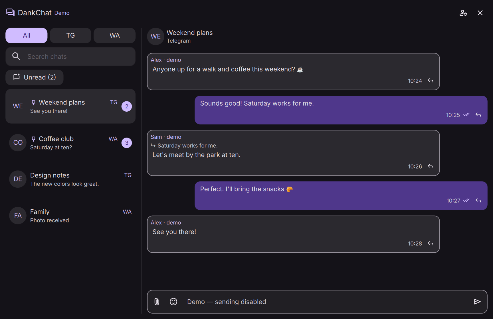

# DankChat

Telegram and WhatsApp in one native [DankMaterialShell](https://danklinux.com/)
plugin. Open a compact dropdown from DankBar or use the same conversation in a
regular, resizable, tiling-capable window. Both services share one interface with
DMS colors and widgets. No Electron runtime or embedded browser.



**Development version · [DMS registry draft PR #884](https://github.com/AvengeMedia/dms-plugin-registry/pull/884).** Both accounts have
been linked in the development environment, and the automated checks pass.
Earlier whole-shell crashes remain under investigation; broader real-account
and compositor testing is still required. See [Validation](#validation).

## Features

### Chats and messages

- Combined chat list with **All / TG / WA** filters and local search across chat
  names and previews. The search field has an X to clear it.
- **Unread** toggle with a matching unread-chat count. Combine it with the
  provider filter and search; click again to show all matching chats.
- Pinned chats appear first. Right-click a chat to **Pin/Unpin** or
  **Mark as read**. Telegram's pin-limit error explains the main-list limit of
  5 chats without Premium and 10 with Premium.
- Text sending, replies, clickable web links, and different incoming/outgoing
  message bubbles. Click a quoted reply to jump to its original message.
- Chats open at the newest message. Scrolling up keeps your reading position;
  a down-arrow returns to the latest messages. Older reply targets load a
  bounded history context rather than the entire chat history.
- Sent, delivered and read indicators where the provider supplies that state.
  See [Read state and receipts](#read-state-and-receipts) for differences.
- Separate in-memory drafts for each chat, shared between the dropdown and app
  window. Drafts do not survive a shell restart.

### Emoji and media

- Themed emoji picker beside the attachment button, with all **3,953 Unicode
  Emoji 17.0 entries**, including skin tones, flags and compound sequences.
- Offline emoji search using German and English names/keywords, category
  browsing, and an X to clear the search. Selection inserts at the cursor or
  replaces selected text.
- Automatic media loading in the open chat, newest first, one file at a time.
  Closing both surfaces stops further automatic downloads; failed downloads
  can be retried manually.
- Inline images and supported stickers. Click an image to enlarge it, zoom with
  the wheel or +/− buttons, drag to pan, and double-click to toggle/reset zoom.
- Inline video and audio playback. The video expand button opens a larger
  player inside the current window without restarting playback. Message updates
  preserve existing players.
- One-file attachment sending through an embedded, themed DMS file browser and
  a separate Send confirmation. Closing the picker cancels selection.
- **Save media as…** on loaded media, with destination selection and overwrite
  confirmation. Media can also open in an external viewer.

### Accounts and DMS integration

- Telegram and WhatsApp QR linking directly in the Accounts panel, without a
  terminal. Telegram also supports the additional account password when needed.
- **Disconnect account** with confirmation. Successful logout revokes DankChat's
  session and clears its local account cache and drafts; phone/cloud messages
  remain intact. Failed remote logout preserves the local session.
- One background service shared by widget instances on multiple bars, plus an
  unread-message count on the bar widget.
- DMS themes, German UI translations, and a sample-data mode with sending
  disabled. WhatsApp synchronization runs as a systemd user service.

## Using the widget

| Action | Behavior |
| --- | --- |
| Left-click the bar widget | Toggle the compact chat dropdown. |
| Click outside the dropdown | Close the dropdown. |
| Right-click the bar widget | Open the regular app window. |
| Open-in-new button in the dropdown | Move the conversation into the app window. |
| Desktop launcher | Open the app window. |
| Right-click a chat | Pin/unpin it or mark it as read. |
| Enter / Shift+Enter in the composer | Send / insert a newline. |
| Accounts button | Link or disconnect either provider. |

The app window closes independently of outside clicks. Switching between the
window and dropdown preserves the selected chat and draft.

IPC entry points:

```sh
dms ipc call dankChat open
dms ipc call dankChat accounts
dms ipc call dankChat close
```

### Read state and receipts

- **Telegram:** automatic marking as read when opening a chat is off by default.
  Enable **Telegram read receipts** in the plugin settings if desired. The
  explicit **Mark as read** menu action works independently of this setting.
- **WhatsApp:** opening a chat acknowledges DankChat's local unread badge.
  **Mark as read** explicitly synchronizes the chat's read state with WhatsApp;
  this is separate from sender-visible per-message read receipts.
- **Incoming receipt updates:** Telegram provides sent/read state. WhatsApp
  delivery/read indicators use signed live receipt events on loopback only
  (`127.0.0.1`), without message bodies or external forwarding. Historical
  messages without recorded receipts show only the sent state. For groups, a
  receipt means at least one participant confirmed it, as stated in the tooltip.

Receiving receipt updates does not enable outgoing read receipts. The **Unread**
filter uses the same unread state as the chat-list badges; its counter counts
chats, while the bar counter counts unread messages. Marking a chat read removes
it from the filtered list without closing the conversation.

## Requirements and installation

- DMS **1.6.1+**, Quickshell, Python **3.10+**, and systemd user services.
- Telegram: Telethon, qrcode and Pillow in the project virtualenv. Both QR flows
  use qrcode and Pillow, so run the setup script even for WhatsApp-only use.
- WhatsApp: **wacli 0.17.1** at `~/.local/bin/wacli`.
- Qt Multimedia and image-format plugins for inline media. On Arch, the relevant
  packages are `qt6-multimedia-ffmpeg` and `qt6-imageformats`.
- An emoji font for glyph rendering and a desktop viewer for externally opened
  media. Newer emoji may require an updated font.

Tested development environment: Arch Linux, Hyprland 0.56.2, DMS 1.6.1,
Quickshell 0.3.1 and Qt 6.11.2. Other combinations are not yet verified.

From a checkout, with DMS running:

```sh
sh scripts/setup-telegram
python3 scripts/install-local
```

The installer links the checkout under
`~/.config/DankMaterialShell/plugins/DankChat`, installs the WhatsApp user unit,
and adds a DankChat desktop launcher. It preserves the bar layout and does not
install wacli. Enable DankChat in **DMS Settings → Plugins**, then add its widget
to DankBar. Keep the checkout at its installed path.

For WhatsApp, download the matching build from the
[official wacli 0.17.1 release](https://github.com/openclaw/wacli/releases/tag/v0.17.1),
verify its checksum against the release's `checksums.txt`, and place the executable
at `~/.local/bin/wacli`. Open **Accounts** in DankChat and complete QR linking on
your phone.

Both providers are enabled by default. Telegram connects when linking is
requested or a DankChat session exists. WhatsApp sync starts after a linked
session is found. Disabling a provider pauses it and preserves its session;
disabling WhatsApp or DankChat stops WhatsApp sync.

### Registry installation

The [registry submission](https://github.com/AvengeMedia/dms-plugin-registry/pull/884)
is a draft; DankChat is not yet available in the public plugin catalog. After approval, install it through the DMS plugin browser. The
registry downloads the plugin source; it does not install wacli, the Python
virtualenv or the WhatsApp user unit. Open the downloaded plugin directory and
run `sh scripts/setup-telegram` followed by `python3 scripts/install-local` before
enabling it. The latter also installs the launcher and sync unit, without creating
a duplicate plugin when the checkout is already inside DMS's plugin directory.

### Allowing the app window to tile

If your compositor floats all DMS windows, add an exception for the exact title
`DankChat`. A Hyprland Lua example is provided in
[integration/hyprland.lua](integration/hyprland.lua); load it after the general
DMS window rules. The app window is resizable, not a forced fullscreen surface.

## Local data

DankChat uses its own account sessions; it does not import upstream session files.

| Data | Location |
| --- | --- |
| Telegram session/config | `$XDG_CONFIG_HOME/dankchat/telegram` |
| Telegram media cache | `$XDG_CACHE_HOME/dankchat/telegram` |
| WhatsApp state and helper data | `$XDG_STATE_HOME/dankchat/whatsapp` |
| Runtime lock | `$XDG_RUNTIME_DIR/dankchat` |

Standard XDG defaults apply when variables are missing or relative. Session
directories are private to your user. DMS plugin preferences contain ordinary
settings, not account sessions. Passwords and message payloads travel to the
bridge over a private stdin pipe; the inherited WhatsApp helper passes message
arguments to the wacli executable.

Telegram uses the upstream default public client application credentials. Custom
`api_id` / `api_hash` values can be supplied in
`$XDG_CONFIG_HOME/dankchat/telegram/config.json`, separately from DMS settings.

Failed or timed-out sends are never automatically resent. Check the conversation
before retrying: the remote service may already have accepted the message.

## Known limitations

- This is a shared client, not full parity with the official Telegram/WhatsApp
  applications. Telegram topics, message editing/forwarding, message pinning and
  reactions are not implemented in the shared UI. **Chat pinning is supported.**
- WhatsApp voice recording, group mentions and multiple-account setup are not
  implemented in the shared UI.
- Telegram vector stickers and some media formats are not rendered inline;
  unsupported files can be opened externally. Media/gallery parity is incomplete.
- Deleted or unsynchronized quoted messages may be unavailable. General browsing
  of the complete older message history is not implemented.
- Drafts are not persisted across restarts. Full keyboard/accessibility checks,
  network-loss/suspend recovery, vertical-bar and multi-monitor acceptance, and
  fresh-install checks on another environment remain outstanding.
- Earlier whole-shell crashes are not conclusively resolved by the automated
  tests. Real-account send, attachment, logout/relink and cross-device behavior
  still need broader acceptance testing.

Registry submission remains gated on working real-account tests, stability
review and a representative screenshot containing only synthetic conversations.

## Validation

Run the backend, QtTest, QML parsing and manifest-schema checks:

```sh
.venv/bin/pip install jsonschema
sh scripts/test
```

Run the isolated UI and service checks from a working DMS/Wayland session
(requires `ffmpeg`, `qs`, Qt test tools and `dbus-run-session`):

```sh
python3 scripts/test-ui
python3 scripts/test-ui --service
```

The UI harness opens temporary test windows, copies DMS components and uses
private XDG directories, a private session bus, synthetic chats and generated
media. It does not use real account databases or send real messages. Set
`DANKCHAT_DMS_SOURCE` to the active DMS source directory if its path differs from
the development default in the script.

The final automated pass covered 31 project Python tests, 152 passing upstream
WhatsApp tests with one intentional skip, both QtTest suites, UI/media regressions
and a 200-step service run. See [docs/validation.md](docs/validation.md) for the
recorded environment, results and remaining acceptance checks.

Emoji data is bundled for offline use. Maintainers can regenerate the pinned
Unicode/CLDR dataset with `python3 scripts/update-emoji-data`; this maintenance
command requires network access.

## Uninstall

Disable DankChat and remove its widget from DankBar. Stop
`dankchat-whatsapp.service`, remove its user unit and reload systemd, then remove
the development symlink and `dankchat.desktop` launcher. Keep the checkout if
you want to continue development. Account data is preserved; use **Disconnect
account** before uninstalling if you also want to revoke the session.

## Credits and license

MIT. Built on [OmarGram](https://github.com/JoeJoeflyn/omargram) and
[OmaWhatsApp](https://github.com/MoizIbnYousaf/Omarchy-Whatsapp). Unicode emoji and
CLDR annotations retain the Unicode License v3. See
[THIRD_PARTY_NOTICES.md](THIRD_PARTY_NOTICES.md) and
[docs/upstream.json](docs/upstream.json).

The DMS integration was developed with AI assistance. The
[validation record](docs/validation.md) distinguishes automated checks from
real-account acceptance testing.
