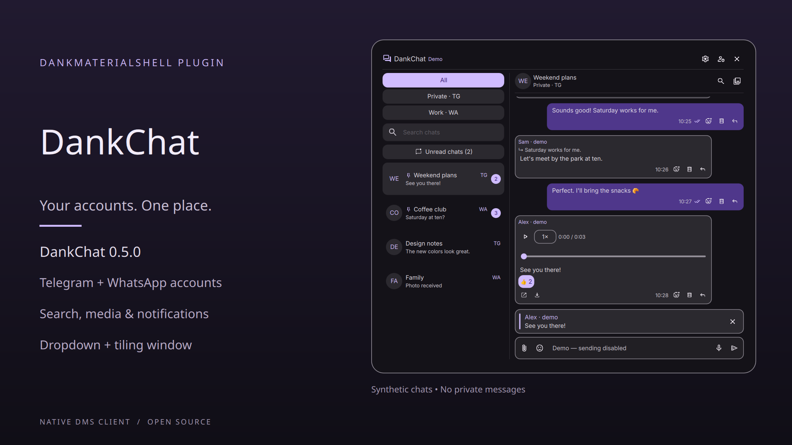

# DankChat

Telegram and WhatsApp, right in [DankMaterialShell](https://danklinux.com/).
Check a conversation from the bar or open a regular window when you need more
room. Built with native QML widgets, without Electron or an embedded browser.



## What it does

- Multiple Telegram and WhatsApp accounts, with named account buttons, pinned chats and an unread filter.
- Search messages and browse each chat’s images, videos, files, audio and links.
- Replies, emoji reactions, editing and message deletion, including “for everyone” where supported.
- Paste screenshots, select multiple attachments and save received media.
- View images with zoom, watch videos and listen to voice messages with seeking
  and playback speed controls.
- Record a voice message, listen back, then send it or discard it.
- Typing indicators for both services, plus Telegram online and last-seen status.
- QR sign-in, DMS themes, and English and German interfaces.
- Account-specific read synchronization and notifications, media/cache settings, release checks and a private diagnostic report.

## Install

You'll need **DMS 1.6.1+**, Quickshell, **Python 3.10+** and systemd user services.
For media, install Qt Multimedia and image-format plugins (`qt6-multimedia-ffmpeg`
and `qt6-imageformats` on Arch). Clipboard attachments need **wl-clipboard**.
Desktop notifications optionally use **notify-send** (libnotify).
Voice recording needs **FFmpeg** with libopus and PulseAudio input, using either
PulseAudio or PipeWire with `pipewire-pulse`.

Install DankChat from **DMS Settings → Plugins**, open its installed folder
(usually `~/.config/DankMaterialShell/plugins/dankChat`) and run:

```sh
python3 scripts/setup
```

This sets up the Python libraries, QR linking, background sync and desktop
launcher. If wacli is missing, it downloads the tested **0.19.0** release from
[the official project](https://github.com/openclaw/wacli/releases/tag/v0.19.0),
verifies its SHA-256 checksum and installs it at `~/.local/bin/wacli`.
Compatible existing versions are kept. Use `--telegram-only` to skip WhatsApp,
or `--update-wacli` to replace an older build with the tested one and keep a backup.
DMS and the system packages above still need to be installed separately.

Enable DankChat, add its bar widget, then open **Accounts** to link your accounts.
For a Git checkout, clone this repository and run the same setup command from it;
the installer links that folder into DMS, so keep it in place.

**Updating from 0.4:** update the plugin through DMS, rerun `python3 scripts/setup`
and restart DMS when convenient. Existing accounts and settings are retained;
unsent drafts are kept only in memory. See the [changelog](CHANGELOG.md) for
what changed in 0.5.0.

DankChat uses the public `DankPopout` component, including on DMS Git builds
that no longer export `DankPopoutStandalone`. If an older DankChat version
reports **DankPopoutStandalone is not a type**, update DankChat. Version 0.5.1
also fixes blank windows caused by **FileBrowserContent is not a type** on newer
DMS builds, while retaining the older file picker. Run
`python3 scripts/check-environment` to check the required component files.

## Everyday use

**Left-click** the widget for the dropdown; **right-click** for the app window.
Clicking outside closes the dropdown. The expand button moves the conversation
into the app window, keeping your draft.

Right-click a chat to pin it or mark it as read. Use the message actions to
reply, react, edit or delete. The magnifier and gallery icons in the chat header
open message search and media browsing. **Enter** sends; **Shift+Enter** adds a line break.
The microphone button starts a recording, with a preview before sending.

Use the gear for **Settings**, or **Accounts** to name each account and choose
whether reading a chat here also marks it as read on your other devices. Read
synchronization is opt-in per service/account. Without it, WhatsApp keeps its
local badge acknowledgement. Phone-side reads still clear the remote unread
state. Sender-visible receipts remain subject to each service’s privacy rules.
The bar counter counts unread chats, not messages.

If the app window always floats, see the [Hyprland rule](integration/hyprland.lua)
for an exception using the title `DankChat`.

## A few limits

DankChat covers everyday messaging, but doesn't yet support Telegram topics or
forwarding. WhatsApp search covers the history synced to this linked device.
Drafts stay in memory and are lost when DankChat restarts.

WhatsApp online/last-seen status isn't exposed by the current backend. Some
stickers and media formats need an external viewer; attachments that haven't
synced to the linked device may be unavailable. Read indicators depend on the
receipt data available to DankChat. “Mentions only” notifications currently work
with Telegram; WhatsApp cannot expose reliable mention metadata through wacli.
Notifications start disabled and can be configured per account and chat.

Attachments are sent individually, up to 10 at a time. Voice recordings stop
after five minutes or when you close the chat; switching chats discards the
recording. If a send fails, check the conversation before trying again.

## More details

- [Setup, local data and troubleshooting](docs/usage.md)
- [Development and testing](docs/development.md)
- [Test results](docs/validation.md)

## License and credits

[MIT](LICENSE) © 2026 coldi1337. DankChat builds on
[OmarGram](https://github.com/JoeJoeflyn/omargram) and
[OmaWhatsApp](https://github.com/MoizIbnYousaf/Omarchy-Whatsapp).
Their notices and the Unicode data license are preserved in
[Third-party notices](THIRD_PARTY_NOTICES.md).

Developed with AI assistance.
